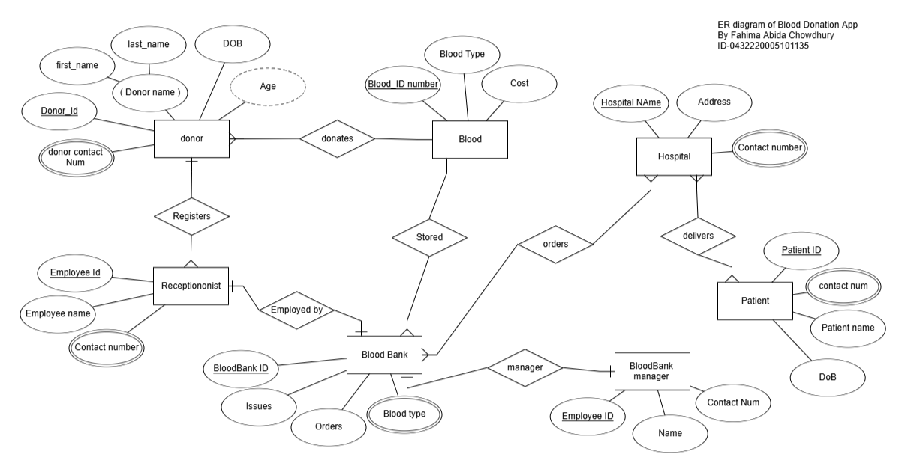
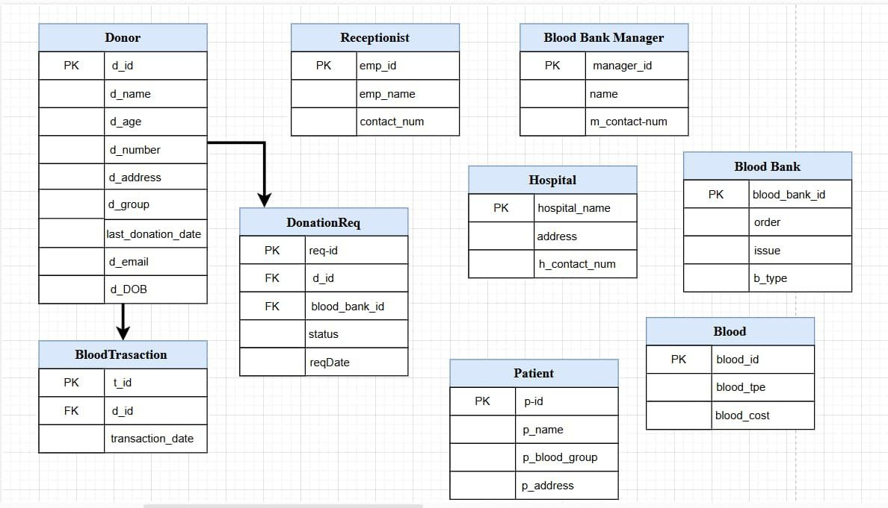
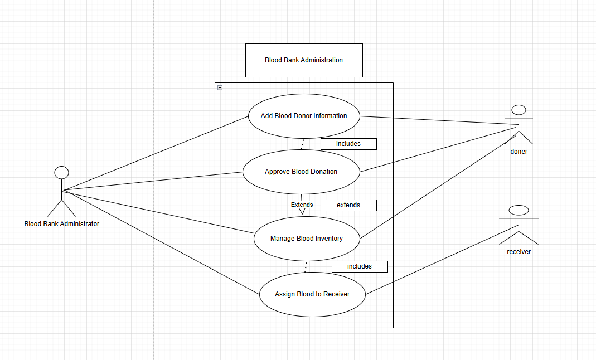
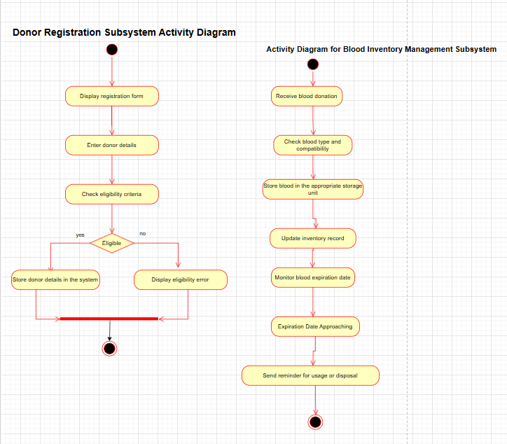
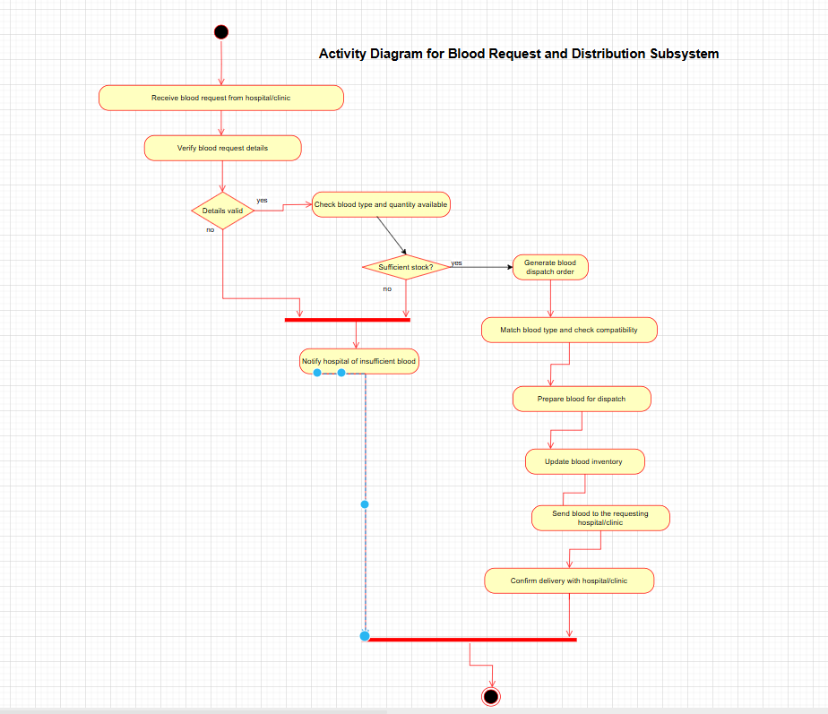

# RedRescue Project - System Models

This page documents the key system models used in the RedRescue Blood Bank Management System.

---

## 1. ER Diagram (Entity-Relationship Diagram)

This diagram shows the database entities and how they relate to each other.

---

## 2. Schema Diagram

The schema diagram provides a more detailed look into the actual database tables and their relationships.

---
## 3. Class Diagram

The class diagram shows the object-oriented structure of the system including classes, attributes, and methods.

.drawio.png)

---
## 4. Use Case Diagram

The use case diagram shows the interaction between actors and the system.

---
## 5. Activity Diagrams

Activity diagrams model the workflows of various subsystems.

### Donor Registration Subsystem

### Blood Inventory Management Subsystem

### Blood Request & Distribution Subsystem

